# Tugas Praktikum Pemrograman Web 2

Nama : Adimas Bayu Aditya
Kelas : TI.23.C1
Dosen : Agung Nugroho, S.Kom., M.Kom.

# Tugas Praktikum 1

- Membuat Controller Lengkap
  [(https://github.com/bayulearning/Lab7Web/blob/6831421c647484a5204dea1b03f9451e961b3550/app/Controllers/Page.php)]

- Membuat View
  [(https://github.com/bayulearning/Lab7Web/blob/6831421c647484a5204dea1b03f9451e961b3550/app/Views/about.php)]

- Membuat Template Header & Footer
  [(https://github.com/bayulearning/Lab7Web/tree/6831421c647484a5204dea1b03f9451e961b3550/app/Views/template)]

- Perubahan Halaman yang terjadi
  

# Tugas Praktikum 2

- Membuat database lokal & Tabel
  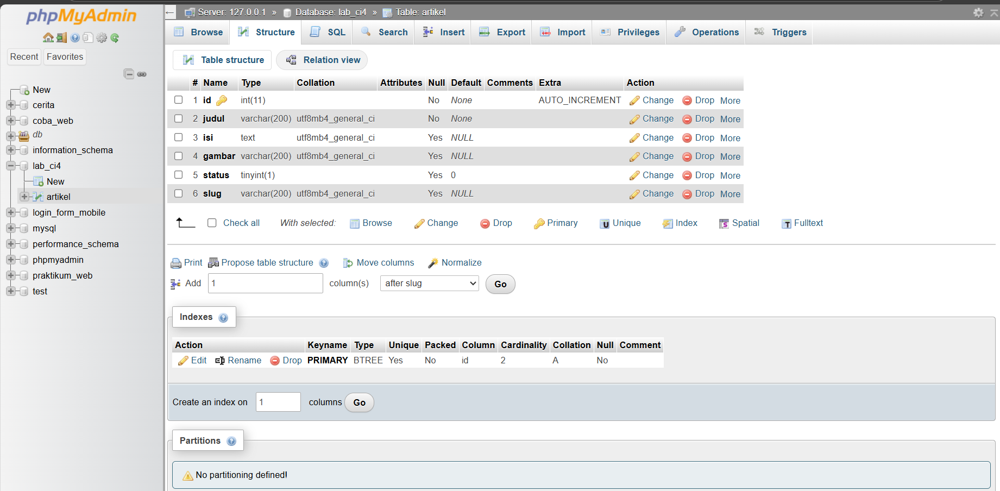

- Membuat Model untuk data artikel
  [(https://github.com/bayulearning/Lab7Web/blob/4038247f70c6fcd9fda9ecd3576cba58d2ab276c/app/Models/ArtikelModel.php)]

- Membuat Controller Baru Artikel.php
  [(https://github.com/bayulearning/Lab7Web/blob/4038247f70c6fcd9fda9ecd3576cba58d2ab276c/app/Controllers/Artikel.php)]

- Membuat View direktori artikel dan index.php dan menghubungkan dengan database
  [(https://github.com/bayulearning/Lab7Web/blob/4038247f70c6fcd9fda9ecd3576cba58d2ab276c/app/Views/artikel/index.php)]
  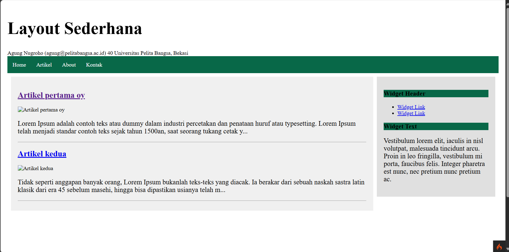

- Membuat tampilan detail artikel
- menambahkan controller
  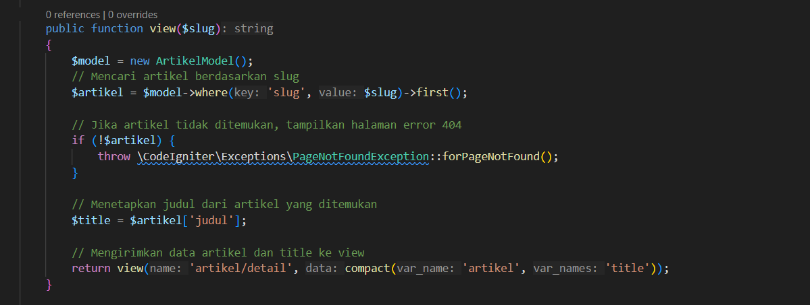
- membuat view detail
  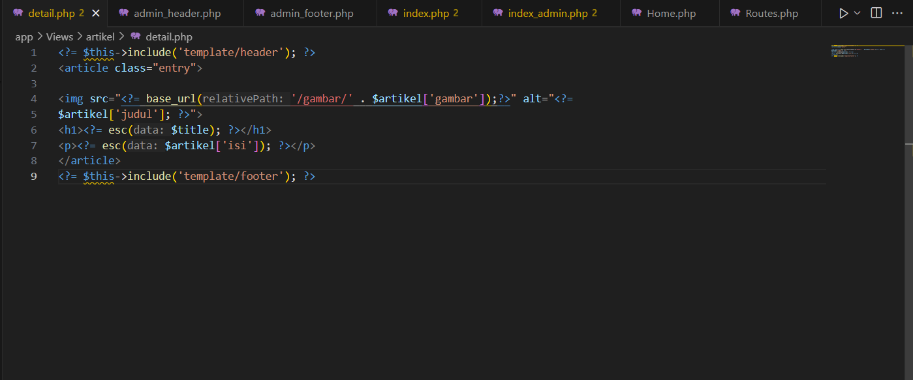
- menambahkan route
  $routes->get('artikel/index', 'Artikel::index');
- tampilan halaman
  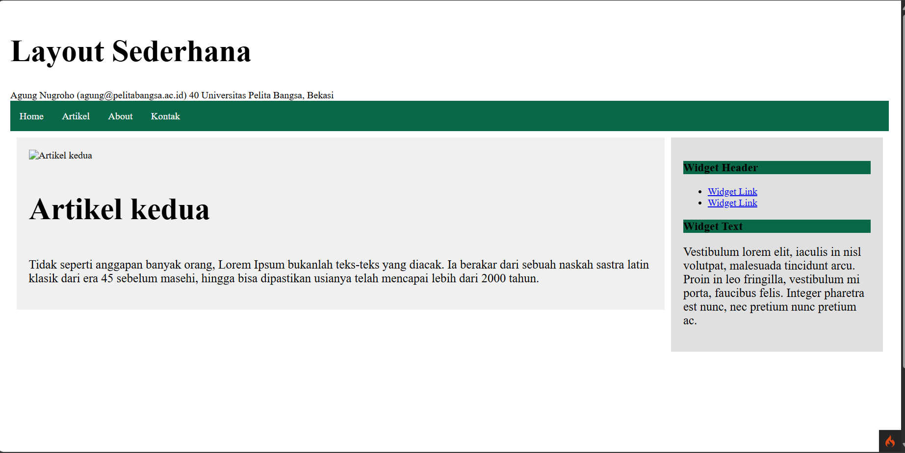

- membuat halaman admin
- menambahkan route

  ````$routes->group('admin', function($routes) {

  $routes->get('artikel', 'Artikel::admin_index');
  $routes->add('artikel/add', 'Artikel::add');
  $routes->add('artikel/edit/(:any)', 'Artikel::edit/$1');
  $routes->get('artikel/delete/(:any)', 'Artikel::delete/$1');

  });```
  ````

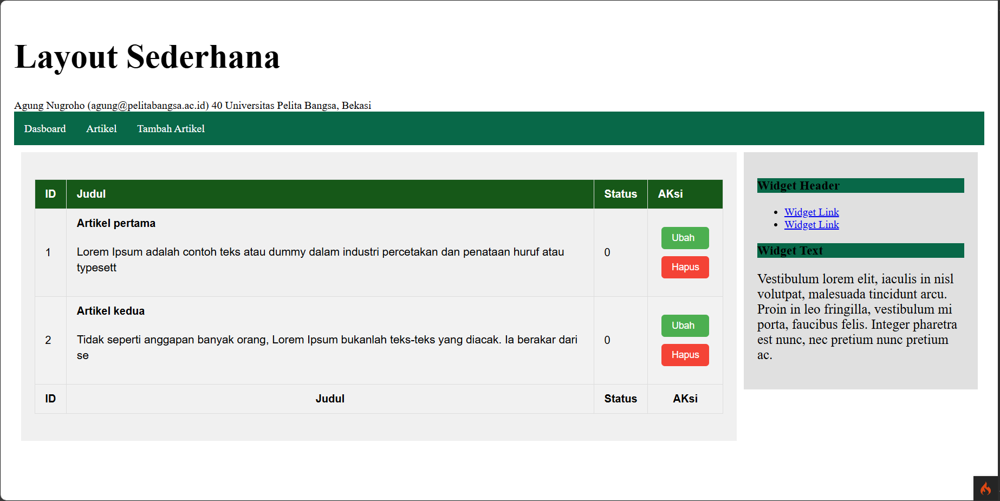

- membuat halaman tambah artikel
  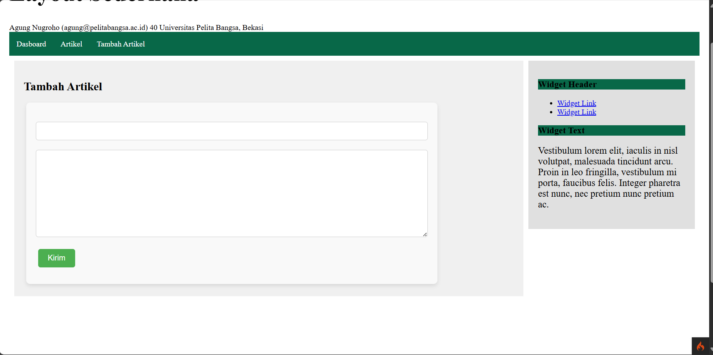

- membuat halaman edit
  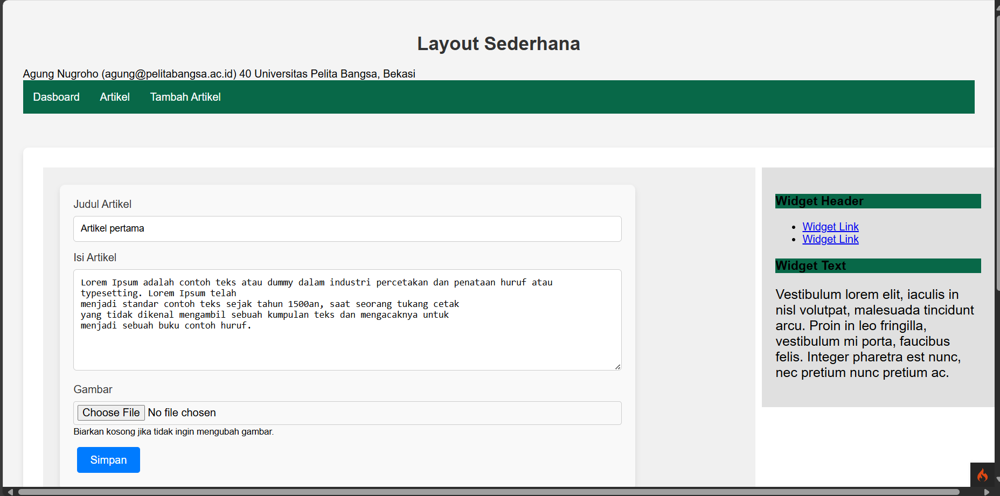

# Tugas Praktikum 3

# Update

# View Layout & View Cell

- menambahkan file main.php pada folder layout sebagai template halaman
  penambahan file main.php sebagai template halaman layout

- menambahkan home.php pada direktori views
  penambahan home.php sebagai halaman uji coba view cell

- menambahkan data dinamis dengan view cell
  data artikel digunakan untuk melihat perubahan
  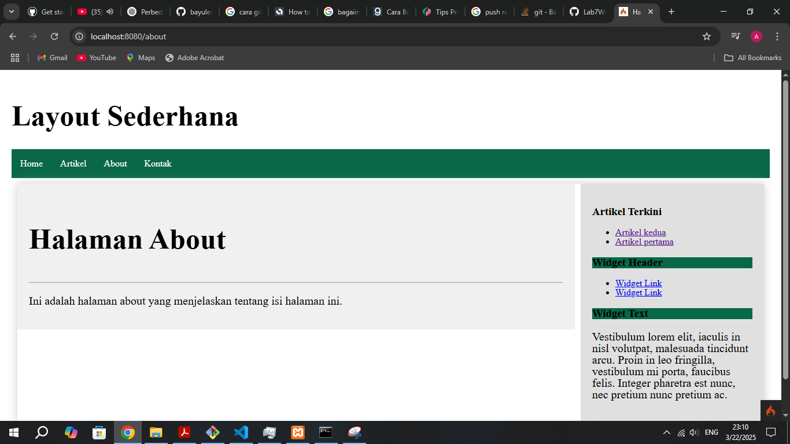
- menambahkan class view cell pada direktori baru Cells dengan nama ArtikelTerkini.php
  class view cells sebagai controller untuk merender tampilan

- membuat view untuk view cell artikel_terkini.php pada direktori components
  untuk menampilkan hasil dari render yang ditambahkan

- manfaat view layout. untuk membuat tampilan web yang dikembangkan lebih dinamis
- perbedaan dari view dan view cells
  View biasa hanya menampilkan konten statis atau dinamis tanpa logika tambahan, dan lebih fokus pada tampilan.

View cell memungkinkan Anda untuk menyematkan logika eksekusi yang lebih terstruktur dalam tampilan, dan dapat digunakan ulang di berbagai tempat dalam aplikasi.

# Tugas Praktikum 4

## Update

- Membuat Tabel User
  membuat tabel di database dengan xampp phpmyadmin
- Membuat Model User
  untuk memproses data Login
- Membuat Controller User
  untuk mengatur fungsi halaman user
- Membuat Database Seeder
  membuat akun login sederhana
- Menambahkan Auth Filter
  menambahkan fungsi untuk menyaring akun yang login dengan kesesuaian di database
- Menambahkan Fungsi Logout

### Features Update

- Membuat View Login
  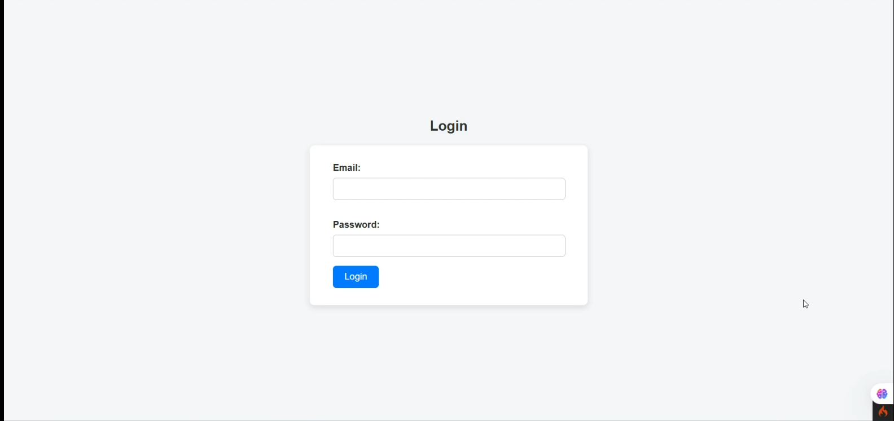

# Tugas Praktikum 5

## Update

- Membuat Pagination atau kelompok data
  Pagination memisahkan data berdasarkan kolom yang ingin ditampilkan
- Membuat kolom pencarian
  kolom pencarian untuk pengguna dapat mencari data yang sesuai dengan kata yang tertulis

### Features

- Kolom Pencarian
- Button kelompok data
  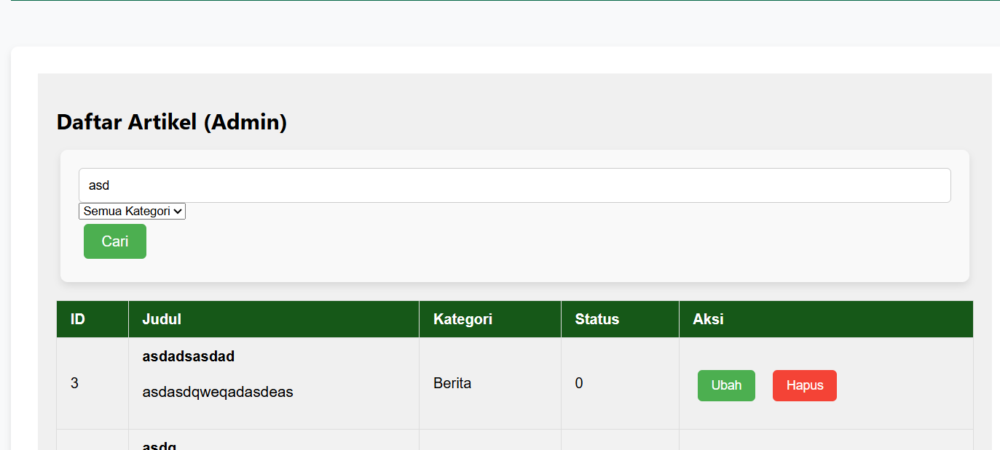

# Tugas Praktikum 6

## Update

- Membuat button untuk menambahkan gambar
  Button gambar dapat digunakan untuk menambahkan gambar ke dalam artikel atau data

### Features

- Upload Gambar
  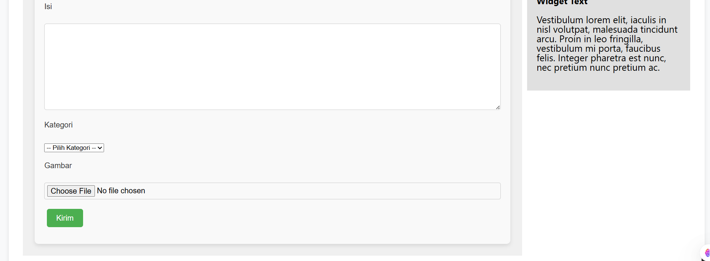

# Tugas Praktikum 7

## Update

- Membuat tabel kategori
  Menambahkan tabel kategori di database untuk memetakan artikel yang sesuai dengan tema
- Membuat Model Kategori
  Untuk mengatur fungsi dari Kategori
- Memodifikasi Model Artikel
  menambahkan perintah untuk relasi dengan kategori model
- memodifikasi controller Artikel
  menggunakan model baru agar dapat menampilkan data relasi
- Memodifikasi View
  Menambahkan kolom kategori pada view
  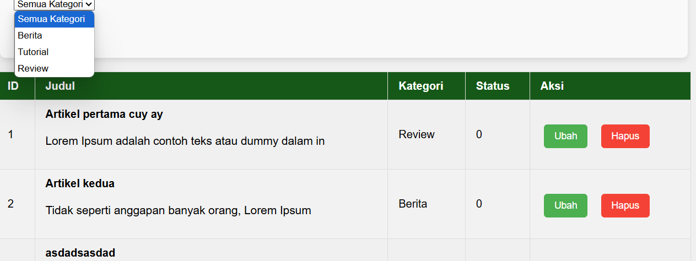

# Tugas Praktikum 8

## Update

- Menambahkan AJAX
- Membuat Model dan Controller AJAX

### Features

- Aksi Tombol Ubah dan Hapus
  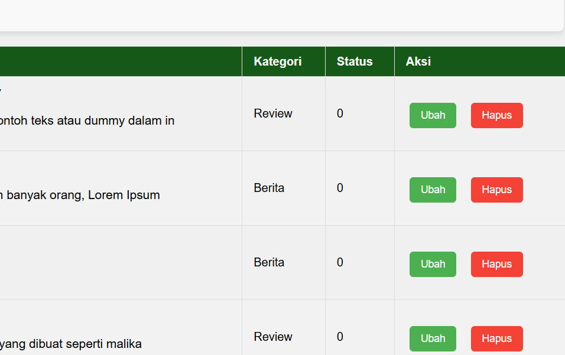

# Tugas Praktikum 9

## Update

- Mengimplementasi Ajax pada Pagination dan Search
  agar proses Pagination dan Search dapat bekerja tanpa halaman merefresh
- Modifikasi Controller Artikel
  agar fungsi Ajax dapat bekerja diperlukan modifikasi pada controller
- Modifikasi View index
  memanggil jquery dan beberapa fungsi dengan java script untuk menjalankan AJAX
  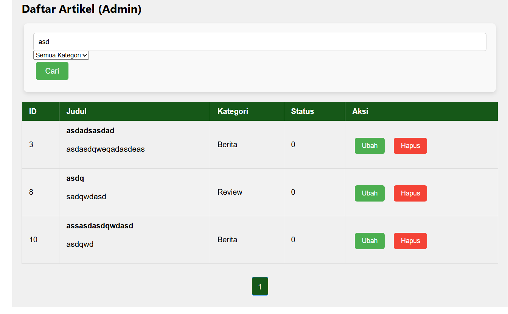
