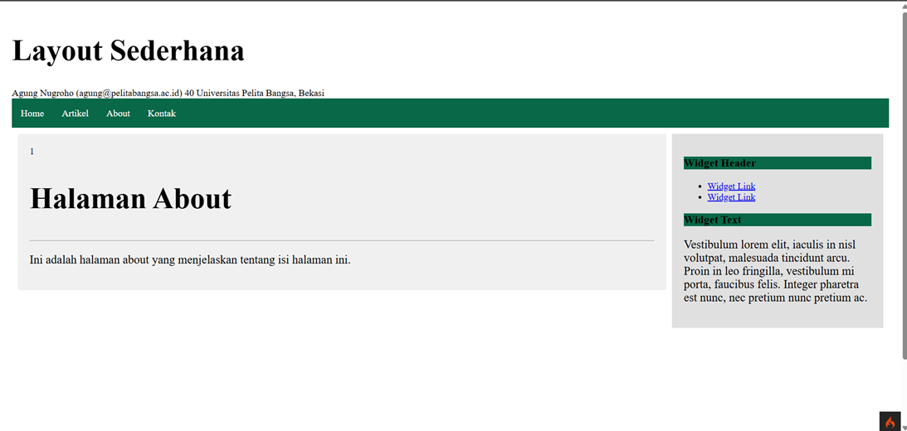

# Tugas Praktikum Pemrograman Web 2

Nama : Adimas Bayu Aditya
Kelas : TI.23.C1
Dosen : Agung Nugroho, S.Kom., M.Kom.

# Tugas Praktikum 1

- Membuat Controller Lengkap
  [(https://github.com/bayulearning/Lab7Web/blob/6831421c647484a5204dea1b03f9451e961b3550/app/Controllers/Page.php)]

- Membuat View
  [(https://github.com/bayulearning/Lab7Web/blob/6831421c647484a5204dea1b03f9451e961b3550/app/Views/about.php)]

- Membuat Template Header & Footer
  [(https://github.com/bayulearning/Lab7Web/tree/6831421c647484a5204dea1b03f9451e961b3550/app/Views/template)]

- Perubahan Halaman yang terjadi
  

# Tugas Praktikum 2
