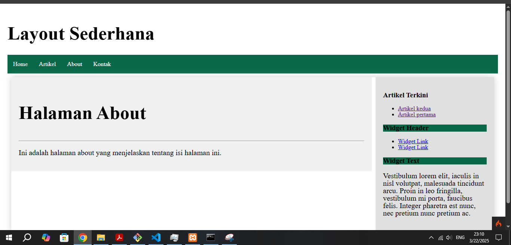

# Tugas Praktikum Pemrograman Web 2

Nama : Adimas Bayu Aditya
Kelas : TI.23.C1
Dosen : Agung Nugroho, S.Kom., M.Kom.

# Tugas Praktikum 1

- Membuat Controller Lengkap
  [(https://github.com/bayulearning/Lab7Web/blob/6831421c647484a5204dea1b03f9451e961b3550/app/Controllers/Page.php)]

- Membuat View
  [(https://github.com/bayulearning/Lab7Web/blob/6831421c647484a5204dea1b03f9451e961b3550/app/Views/about.php)]

- Membuat Template Header & Footer
  [(https://github.com/bayulearning/Lab7Web/tree/6831421c647484a5204dea1b03f9451e961b3550/app/Views/template)]

- Perubahan Halaman yang terjadi
  

# Tugas Praktikum 2

- Membuat database lokal & Tabel
  

- Membuat Model untuk data artikel
  [(https://github.com/bayulearning/Lab7Web/blob/4038247f70c6fcd9fda9ecd3576cba58d2ab276c/app/Models/ArtikelModel.php)]

- Membuat Controller Baru Artikel.php
  [(https://github.com/bayulearning/Lab7Web/blob/4038247f70c6fcd9fda9ecd3576cba58d2ab276c/app/Controllers/Artikel.php)]

- Membuat View direktori artikel dan index.php dan menghubungkan dengan database
  [(https://github.com/bayulearning/Lab7Web/blob/4038247f70c6fcd9fda9ecd3576cba58d2ab276c/app/Views/artikel/index.php)]
  

- Membuat tampilan detail artikel
- menambahkan controller
  
- membuat view detail
  
- menambahkan route
  $routes->get('artikel/index', 'Artikel::index');
- tampilan halaman
  

- membuat halaman admin
- menambahkan route

  ```$routes->group('admin', function($routes) {

  $routes->get('artikel', 'Artikel::admin_index');
$routes->add('artikel/add', 'Artikel::add');
  $routes->add('artikel/edit/(:any)', 'Artikel::edit/$1');
$routes->get('artikel/delete/(:any)', 'Artikel::delete/$1');

  });```


- membuat halaman tambah artikel
  

- membuat halaman edit
  


# Tugas Praktikum 3
 # Update 
 # View Layout & View Cell
 - menambahkan file main.php pada folder layout sebagai template halaman
penambahan file main.php sebagai template halaman layout
<!DOCTYPE html> 
<html lang="en"> 
    <head> <meta charset="UTF-8"> 
    <title><?= $title ?? 'My Website' ?></title> 
    <link rel="stylesheet" href="<?= base_url('/style.css');?>"> 
    </head> 
<body> 
    <div id="container"> 
        <header> <h1>Layout Sederhana</h1> </header> 
        <nav class="nav-bar"> 
            <a href="<?= base_url('/');?>" class="active">Home</a> 
        <a href="<?= base_url('/artikel/index');?>">Artikel</a> 
        <a href="<?= base_url('/about');?>">About</a> 
        <a href="<?= base_url('/contact');?>">Kontak</a> 
    </nav> 
    <div class="container">
    <section id="wrapper" class="content-about">
        <section id="main">
            <?= $this->renderSection('content') ?> 
        </section> </section>    
        <aside id="sidebar" class="sidebar-content"> 
            <div class="widget-box"> 
                <?= view_cell('App\\Cells\\ArtikelTerkini::render') ?> 
                <h3 class="title">Widget Header</h3> 
                <ul> 
                    <li><a href="#">Widget Link</a></li> 
                <li><a href="#">Widget Link</a></li> 
            </ul> 
        </div> 
            <div class="widget-box"> 
                <h3 class="title">Widget Text</h3> 
                <p>Vestibulum lorem elit, iaculis in nisl volutpat, malesuada tincidunt arcu. 
                    Proin in leo fringilla, vestibulum mi porta, faucibus felis. Integer pharetra est nunc,
                     nec pretium nunc pretium ac.</p> 
                    </div> 
        </aside>  
            </div>
            <footer> 
                <p>&copy; 2021 - Universitas Pelita Bangsa</p> 
            </footer> 
        </div> 
    </body> 
    </html>
 - menambahkan home.php pada direktori views
penambahan home.php sebagai halaman uji coba view cell
<?= $this->extend('layout/main') ?> 
<?= $this->section('content') ?> 
<h1>
    <?= $title; ?>
</h1> 
<hr> <p><?= $content; ?></p> 
<?= $this->endSection() ?>
 - menambahkan data dinamis dengan view cell
data artikel digunakan untuk melihat perubahan

 - menambhakna class view cell pada direktori baru Cells dengan nama ArtikelTerkini.php
class view cells sebagai controller untuk merender tampilan
<?php

namespace App\Cells;

use CodeIgniter\View\Cells\Cell;
use App\Models\ArtikelModel;
class ArtikelTerkini extends Cell
{
    public function render(): string
    {
        $model = new ArtikelModel(); 
        $artikel = $model->orderBy('id', 'DESC')->limit(5)->findAll(); 
        return view('components/artikel_terkini', ['artikel' => $artikel]);
    }
} 

 - membuat view untuk view cell artikel_terkini.php pada direktori components
untuk menampilkan hasil dari render yang ditambahkan
<h3>Artikel Terkini</h3> 
<ul> 
    <?php foreach ($artikel as $row): ?> 
        <li>
        <a href="<?= base_url('/artikel/' . $row['slug']) ?>">
            <?= $row['judul'] ?></a></li> <?php endforeach; ?> </ul>

